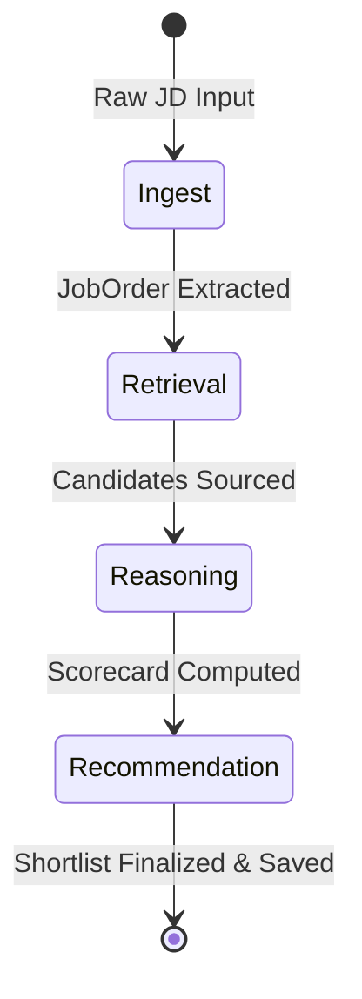

# Agent Design & Orchestration

The **Staffing NBA Platform** divides recruitment intelligence into cooperative, single-responsibility agents sequenced by a **LangGraph** workflow.

---

## 📋 The Shared State Schema (`AgentState`)

All agents operate on a shared, stateful dictionary passed between nodes in the graph. This state is defined in `backend/models/agent_state.py`:

```python
from typing import TypedDict, List, Optional, Any
from backend.models.job_order import JobOrder
from backend.models.action_card import ActionCard
from backend.models.candidate import Candidate

class AgentState(TypedDict):
    job_id: str
    job_order: Optional[JobOrder]
    raw_input_jd: Optional[str]
    raw_input_resumes: Optional[List[str]]
    candidates: List[Candidate]
    evaluated_matches: List[ActionCard]
    logs: List[str]
    errors: List[str]
    current_step: str
```

---

## 🤖 The Core Agents



### 1. Ingest Agent (`ingest_agent.py`)
- **Responsibility**: Parses raw, unstructured text or PDFs (via PyMuPDF) and structures them into a standardized `JobOrder` object.
- **Extraction**: Uses Gemini to identify must-have skills, nice-to-have skills, budget limits, location, and timeline.
- **Fail-safe**: Automatically falls back to random client assignments and standard 72-hour deadlines if the source document is missing metadata.

### 2. Retrieval Agent (`retrieval_agent.py`)
- **Responsibility**: Sources candidates from the CRM SQLite database and retrieves relevant historical constraints from memory.
- **Candidate Lookup**: Queries SQLite based on must-have skills extracted by the Ingest agent. If candidate density is too low, it expands parameters to include all active candidates.
- **Memory Query**: Embeds query parameters using `text-embedding-004` to query Pinecone for past placements or rejection notes for the client/role.

### 3. Reasoning Agent (`reasoning_agent.py`)
- **Responsibility**: Calculates candidate scores and generates natural-language explanations.
- **Traceable Scorecard**:
  - **Skills Match (35%)**: Calculates direct overlap of must-have competencies plus nice-to-have bonuses.
  - **Salary Fit (25%)**: Scores expectations against client budget.
  - **Timeline Fit (20%)**: Compares candidate availability to client target timeline.
  - **Stability Score (20%)**: Checks work history. Average tenure under 12 months is penalized.
- **Gemini task**: Performs qualitative analysis to draft "Top Fit Factors", "Potential Risks", and a detailed "Match Justification" (Evidence Chain).

### 4. Recommendation Agent (`recommendation_agent.py`)
- **Responsibility**: Shortlists the top 3 candidates and generates personalized outreach drafts.
- **Outreach personalization**: Uses candidate skill history and specific reasons-to-hire to draft a 3-4 sentence warm intro email invitation.
- **HitL queue**: Prepares the finalized `ActionCard` records for the recruiter dashboard.

---

## 🐕 The Background Watchdog: Engagement Monitor

Unlike the linear Graph workflow, the **Engagement Monitor** (`engagement_monitor.py`) runs asynchronously on a cron schedule using `APScheduler`.

It continuously scans the database and registers alerts for:
- **Candidate Silence**: Candidate hasn't replied to a recruiter outreach within 48 hours.
- **Client Cold**: Submitted candidate shortlists have sat unreviewed by the client for more than 48 hours.
- **Offer Ghost**: Candidate accepted an offer, but no contact has been logged in 72 hours.
- **Candidate Decay**: Candidates matching an open role have been sitting in "Active" status for more than 14 days, indicating a rising risk of them being hired elsewhere.

These alerts appear as banners in the Recruiter's dashboard, complete with pre-drafted follow-up emails for fast action.
