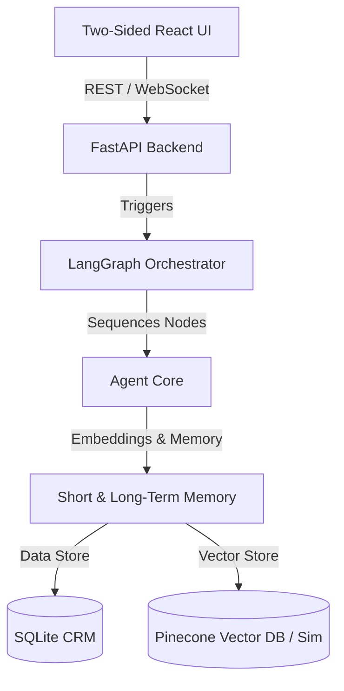
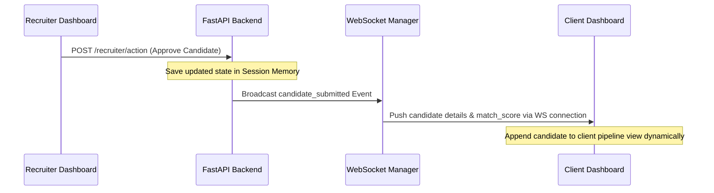

# System Architecture

The **Staffing NBA Platform** utilizes an event-driven, agentic design with a two-sided user interface to enable real-time recruitment pipeline tracking, explainable AI matching, and continuous learning from Human-in-the-Loop (HitL) feedback.

---

## 📐 Component Overview

The application is structured into four primary layers:

### 1. Two-Sided React Frontend
- **Recruiter View (`/recruiter`)**: Displays the active priority matching queue, pending actions, and system engagement alerts (e.g. candidate ghosting warnings).
- **Client Portal (`/client`)**: Provides hiring managers with real-time progress tracking, SLA countdown clocks, and a structured feedback panel to approve/reject candidates.

### 2. FastAPI Backend
- Acts as the central hub.
- Handles HTTP requests for ingestion, feedback submission, and database lookups.
- Maintains a real-time **WebSocket Server** to push updates instantly to client dashboards when recruiters take action.

### 3. LangGraph Orchestrator
- Leverages a StateGraph to direct the execution path between cooperative agents (`Ingest`, `Retrieval`, `Reasoning`, `Recommendation`).
- Standardizes input/output schemas using a shared state definition (`AgentState`).

### 4. Memory & Learning Layer
- **Short-Term Memory**: Keeps track of current session shortlists, active job orders, and active pipelines.
- **Long-Term Memory**: Integrates with Pinecone (or falls back to a local JSON vector simulation) to store historical placement outcomes and past client rejection reasons.

---

## 🔄 Real-Time Pipeline Sync (WebSocket Flow)

To ensure clients are never left in a "black hole", recruiter approvals immediately trigger WebSocket broadcasts that update the client pipeline in real-time.

---

## 🧠 Memory Write-Back Loop

Every time a client reviews a candidate, the decision and detailed reasons are fed back into the intelligence layer:

1. **Rejection Logging**: When a client rejects a candidate, they select a structured rejection category (e.g., `underqualified`, `salary_mismatch`) and add specific comments.
2. **Semantic Embedding**: The feedback is converted into text, embedded using `text-embedding-004`, and upserted to Pinecone.
3. **Future Runs retrieval**: When a new Job Description is parsed for that client in the future, the retrieval agent fetches these historical preferences. The reasoning agent then adjusts the matching scores down for profiles that repeat past mistakes, allowing the system to adapt dynamically to client taste.
